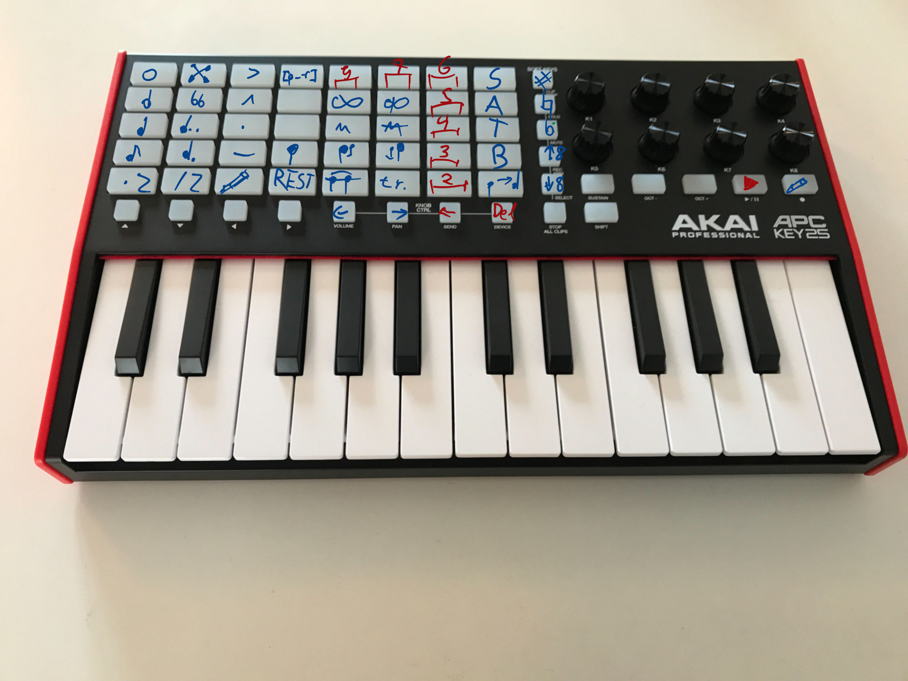

# APC Key 25 mk2 Midi>keypresses
- Designed for Musescore4
- Musescore3 only with jackctl for Midi assignment
- Tested on Debian13

## Dependencies
- xdotool (Recommended) or wtype
- python3
- alsa-utils (amidi)
- git

## RUN
1. install dependencies
2. `git clone https://github.com/SyndraLover/Akai-APC-Key-25-mk2-Midi-for-Musescore.git`
3. `cd Akai-APC-Key-25-mk2-Midi-for-Musescore`
4. `amidi -l`
    - Find `IO  hw:x,y,z  APC Key 25 mk2 Control`
    - change hw_midi=hw:x,y,z in main.py
5. change key_func in main.py for your Desktop (wtype for Wayland/ xdotool for Xorg)
6. `python main.py`
    - `python3 main.py`
    - `uv run main.py`
7. Launch Musescore4
8. import keybindings for xorg only.
9. Enable midi Input in Musescore. Only enabling the first input of Akai APC Key 25.
10. Focus Musescore Window and everything should work. You can see inputs in terminal for debug

## Customization
- change bindings in main.py
- change colors in main.py

## Current Layout

## Roadmap
- dynamic button that works without keyboard and mouse
- Voices Exclusively blink: if one is blinking every other should not
- key.conf in seperate file
- cli options (-d debugging -c config.file)
- Gui

## References
- https://github.com/sickcodes/xdotool-gui/blob/master/key_list.csv
- https://cdn.inmusicbrands.com/akai/attachments/APC%20Key%2025%20mk2%20-%20Communication%20Protocol%20-%20v1.1.pdf